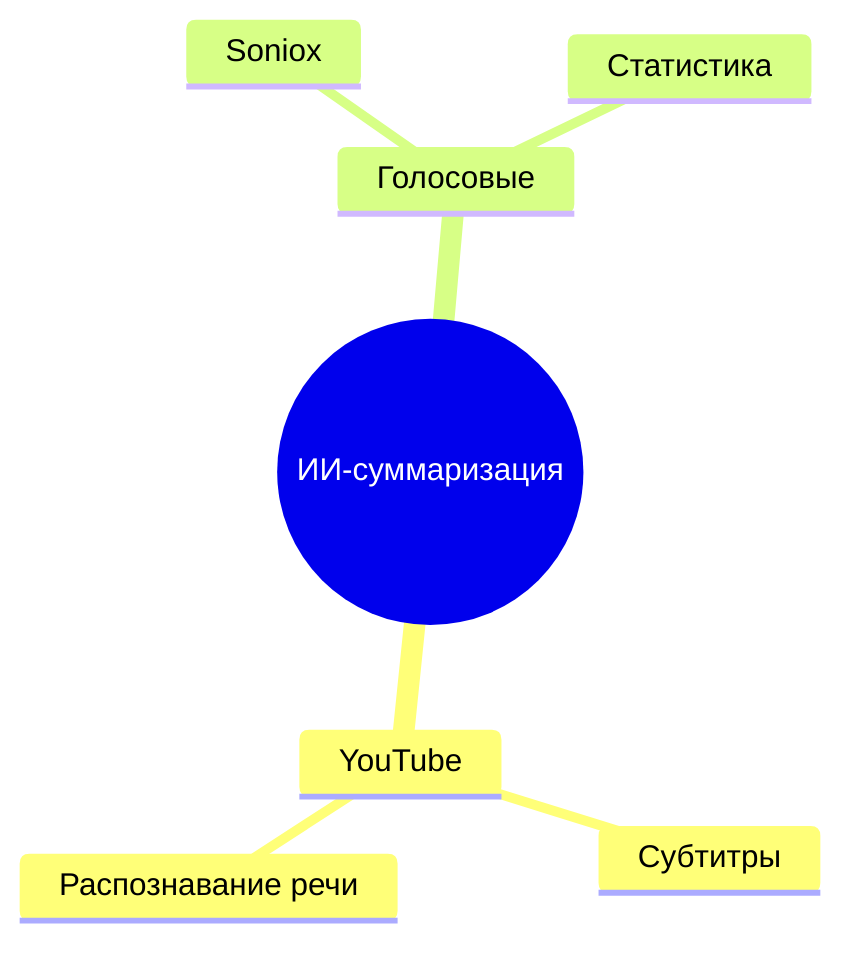

# Mind Map Generator - Документация

## Обзор

Mind Map Generator - это модуль для автоматической генерации mind map из текста (субтитры, суммаризация) с использованием Mermaid или Markmap и последующей отправки в Telegram.

## Возможности

### 🧠 Анализ и структурирование
- **RAG/Chunk-based обработка** длинных текстов
- **AI-анализ** с помощью OpenRouter LLMs
- **Автоматическое выделение** основных идей и подтем
- **Построение иерархии** 2-3 уровня

### 🎨 Генерация визуализаций
- **Markdown файлы** для Markmap
- **Mermaid диаграммы** для статичных изображений
- **PNG/PDF экспорт** через mermaid-cli
- **Интерактивные HTML карты** с Markmap

### 🤖 Интеграция с ботом
- **Кнопка "Построить карту памяти"** после суммаризации
- **Отправка различных форматов** карт
- **Обработка ошибок** и уведомления

## Архитектура

```
MindMapGenerator
├── analyze_text_structure()    # Анализ текста LLM
├── generate_markdown()         # Markdown для Markmap
├── generate_mermaid()          # Mermaid диаграммы
├── render_to_png()            # PNG рендеринг
├── generate_html_markmap()    # HTML карты
└── create_mind_map()          # Основной метод
```

## Установка

### 1. Python зависимости
```bash
pip install -r requirements.txt
```

### 2. Mermaid CLI (для PNG рендеринга)
```bash
npm install -g @mermaid-js/mermaid-cli
```

### 3. Проверка установки
```bash
mmdc --version
```

## Использование

### Базовый пример
```python
from mind_map_generator import MindMapGenerator

# Создание генератора
generator = MindMapGenerator("your_openrouter_api_key")

# Создание mind map
async def create_map():
    text = "Ваш текст для анализа..."
    results = await generator.create_mind_map(text, "all")
    
    print(f"Markdown: {results['markdown']}")
    print(f"Mermaid: {results['mermaid']}")
    print(f"PNG путь: {results['png_path']}")
    print(f"HTML: {results['html_content']}")

# Запуск
asyncio.run(create_map())
```

### Форматы вывода
- `"markdown"` - только Markdown
- `"mermaid"` - только Mermaid код
- `"png"` - только PNG изображение
- `"html"` - только HTML карта
- `"all"` - все форматы

## Конфигурация

### Переменные окружения
```bash
OPENROUTER_API_KEY=your_api_key_here
MERMAID_CLI_PATH=/usr/local/bin/mmdc  # опционально
```

### Настройка промптов
В файле `mind_map_generator.py` можно настроить промпты для LLM:

```python
ANALYSIS_PROMPT = """
Проанализируй следующий текст и выдели:
1. Основную тему
2. Ключевые подтемы (2-3 уровня)
3. Важные пункты для каждой подтемы

Текст: {text}

Ответь в JSON формате:
{
  "main_topic": "главная тема",
  "subtopics": {
    "подтема1": ["пункт1", "пункт2"],
    "подтема2": ["пункт3", "пункт4"]
  }
}
"""
```

## Примеры

### Входной текст
```
ИИ-суммаризация - это технология автоматического создания краткого содержания.
YouTube субтитры используются для извлечения текста из видео.
Распознавание речи позволяет конвертировать аудио в текст.
Голосовые сообщения обрабатываются через Soniox API.
Статистика качества показывает эффективность различных методов.
```

### Сгенерированная структура
```json
{
  "main_topic": "ИИ-суммаризация",
  "subtopics": {
    "YouTube": ["Субтитры", "Распознавание речи"],
    "Голосовые сообщения": ["Soniox", "Статистика"]
  }
}
```

### Markdown результат
```markdown
# ИИ-суммаризация

## YouTube
- Субтитры
- Распознавание речи

## Голосовые сообщения
- Soniox
- Статистика
```

### Mermaid результат


## Тестирование

### Запуск тестов
```bash
# Все тесты
pytest tests/test_mind_map_generator.py

# Конкретный тест
pytest tests/test_mind_map_generator.py::TestMindMapGenerator::test_generate_markdown

# С покрытием
pytest tests/test_mind_map_generator.py --cov=mind_map_generator
```

### Тестовые сценарии
- ✅ Инициализация генератора
- ✅ Анализ структуры текста
- ✅ Генерация Markdown
- ✅ Генерация Mermaid
- ✅ PNG рендеринг
- ✅ HTML Markmap
- ✅ Создание mind map во всех форматах

## Развертывание

### Локальное развертывание
1. Установите зависимости
2. Настройте API ключи
3. Запустите тесты
4. Интегрируйте с ботом

### Хостинг интерактивных карт
#### GitHub Pages
```bash
# Создайте gh-pages ветку
git checkout -b gh-pages

# Добавьте HTML файлы
git add mind_maps/
git commit -m "Add mind map HTML files"
git push origin gh-pages

# Включите GitHub Pages в настройках репозитория
```

#### Netlify/Vercel
1. Подключите репозиторий
2. Настройте автоматическое развертывание
3. HTML файлы будут доступны по URL

## Troubleshooting

### Ошибки Mermaid CLI
```bash
# Проверьте установку
mmdc --version

# Переустановите при необходимости
npm uninstall -g @mermaid-js/mermaid-cli
npm install -g @mermaid-js/mermaid-cli
```

### Проблемы с API
- Проверьте API ключ OpenRouter
- Убедитесь в достаточности кредитов
- Проверьте rate limiting

### Ошибки рендеринга
- Проверьте синтаксис Mermaid
- Убедитесь в доступности mermaid-cli
- Проверьте права на запись в папку

## Планы развития

### Краткосрочные (1-2 недели)
- [ ] Интеграция с существующим ботом
- [ ] Улучшение промптов для LLM
- [ ] Добавление кэширования результатов

### Среднесрочные (1-2 месяца)
- [ ] Поддержка различных языков
- [ ] Настраиваемые стили карт
- [ ] Экспорт в другие форматы (SVG, PDF)

### Долгосрочные (3+ месяца)
- [ ] Машинное обучение для улучшения анализа
- [ ] Интеграция с Obsidian/XMind
- [ ] Коллаборативные карты

## Поддержка

### Логи
Все операции логируются в стандартный лог Python:
```python
import logging
logging.basicConfig(level=logging.INFO)
```

### Отладка
Включите детальное логирование:
```python
logging.getLogger('mind_map_generator').setLevel(logging.DEBUG)
```

### Сообщения об ошибках
Создавайте issues в репозитории с:
- Описанием проблемы
- Логами ошибок
- Примером входных данных
- Ожидаемым результатом
